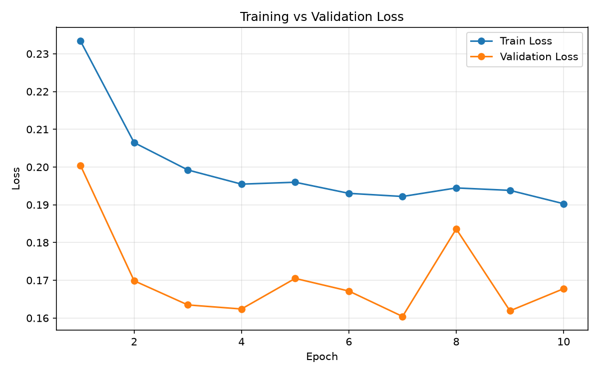
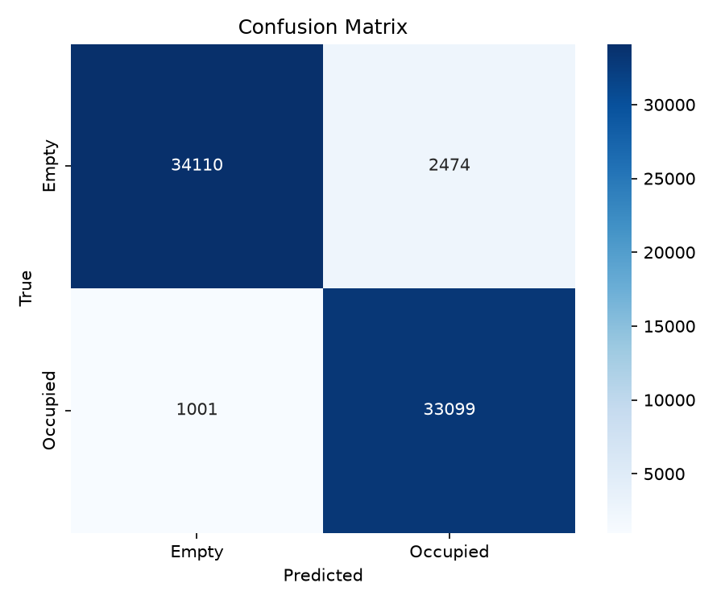
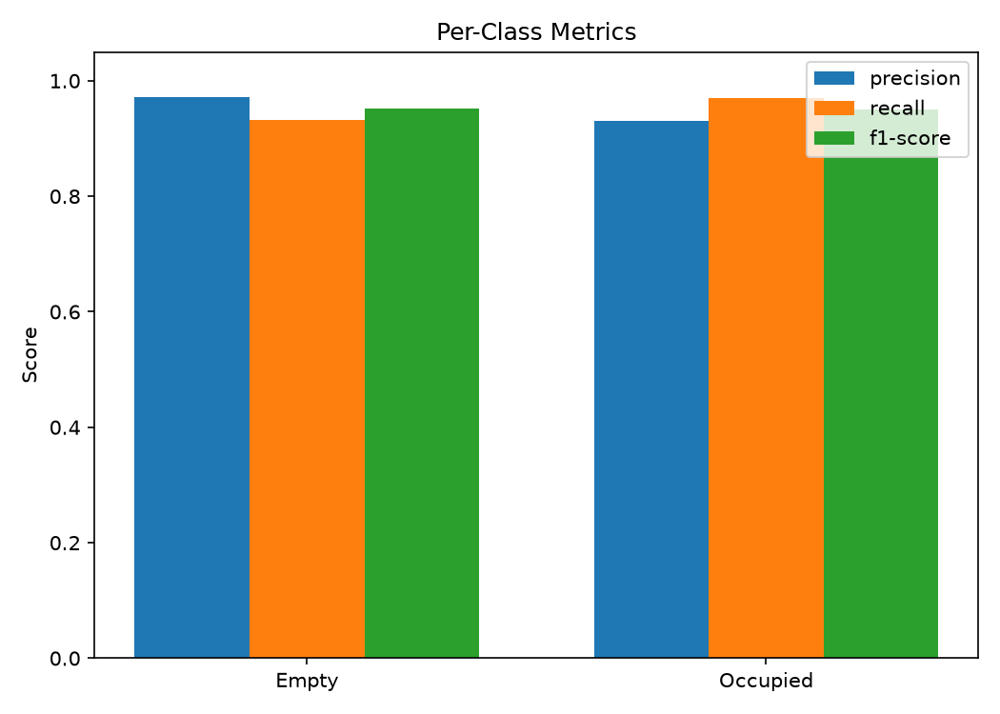
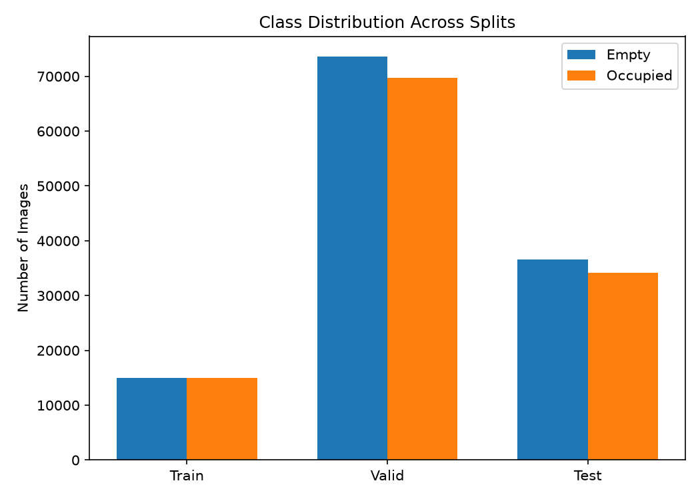
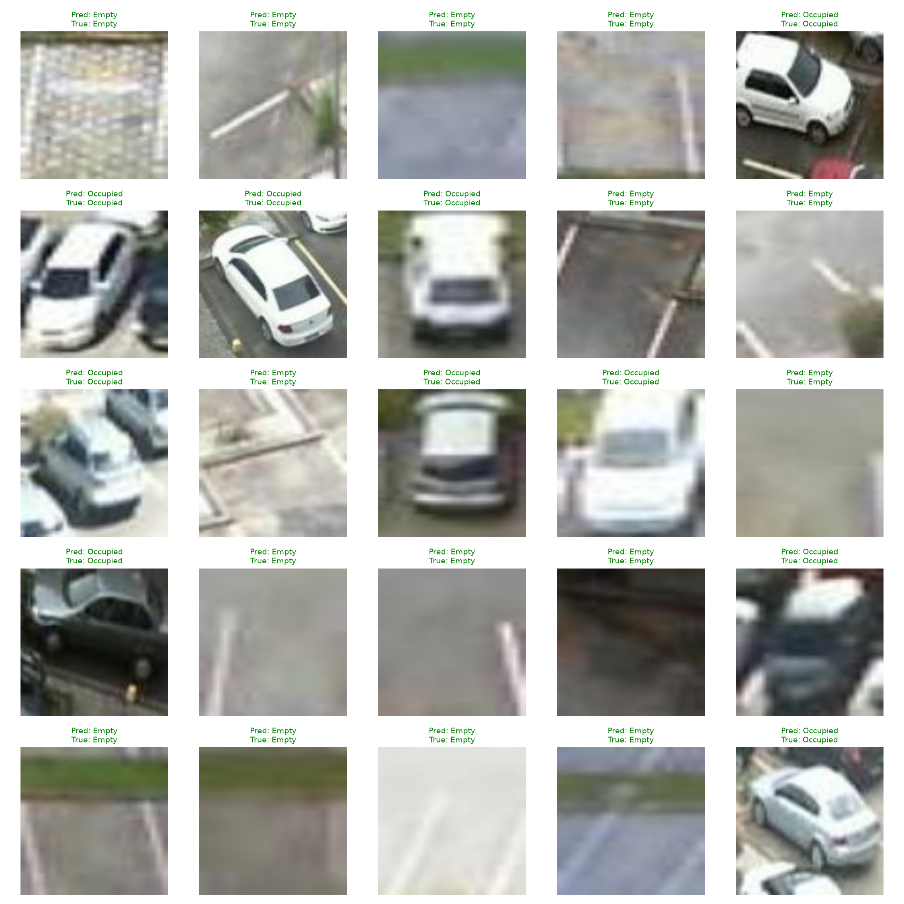
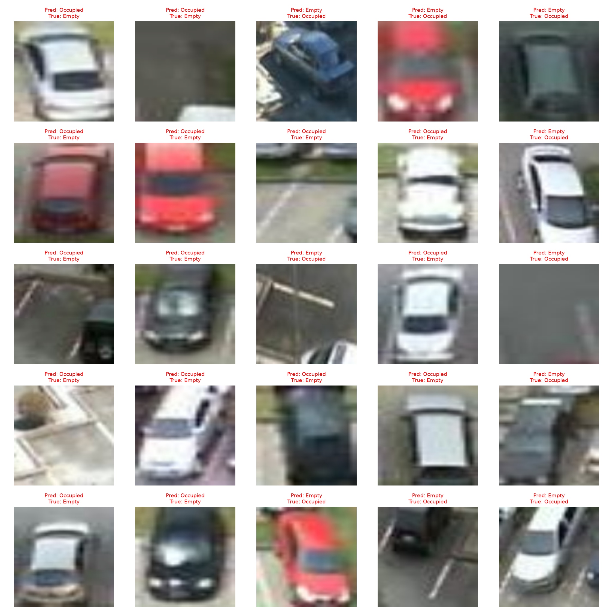

# Smart Parking Occupancy Detection

A computer vision system that classifies individual parking spaces as **empty** or **occupied** using transfer learning on the PKLot dataset. Built as an exploration of applying ML to a real infrastructure problem — parking lot inefficiency.

## Problem

Drivers waste significant time circling lots looking for open spots, and most parking infrastructure has no live occupancy data. This project explores a low-cost approach: instead of installing per-spot sensors (the industry-standard but hardware-heavy approach), use existing or low-cost cameras and a lightweight vision model to classify space occupancy directly from images.

## Approach

Rather than training a full object detector to locate *and* classify every space in a raw camera frame, this project splits the problem into two parts:

1. **Space localization** — defined once per fixed camera (manually, or via provided dataset annotations)
2. **Space classification** — a binary image classifier that looks at a single cropped space and predicts empty or occupied

This crop-then-classify design keeps the model simple to train while matching exactly how it would be used in a real deployment: one camera, many spaces, each cropped and classified independently (batched for efficiency).

## Dataset

**[PKLot](https://public.roboflow.ai/object-detection/pklot)** — 12,416 images of parking lots across 3 locations (PUC, UFPR04, UFPR05) under sunny, cloudy, and rainy conditions, sourced via a Roboflow COCO-format export (object detection annotations, not pre-cropped).

Since the raw dataset provides full lot images with bounding-box annotations rather than pre-cropped classification data, a preprocessing script (`src/data/prepare_split.py`) parses the COCO annotations and extracts individual space crops, sorted by label:

```
data/processed/{train,valid,test}/{Empty,Occupied}/
```

| Split | Empty | Occupied | Total |
|-------|-------|----------|-------|
| Train (subsampled) | 15,000 | 15,000 | 30,000 |
| Valid | 73,629 | 68,687 | 143,316 |
| Test | 36,584 | 34,100 | 70,684 |

Training was run on a balanced 30,000-image subsample of the full ~500,000-image train split, to keep iteration fast during development. Validation and test sets were used in full, untouched.

## Model

- **Architecture:** ResNet18, pretrained on ImageNet
- **Transfer learning:** all pretrained backbone layers frozen; the final fully-connected layer replaced with a fresh binary classification head (512 → 2)
- **Trainable parameters:** 1,026 out of 11,177,538 total
- **Input:** 128×128 RGB crops, normalized with standard ImageNet statistics
- **Loss:** Cross Entropy Loss
- **Optimizer:** Adam, lr=0.001
- **Training:** 10 epochs, batch size 32, best checkpoint selected by validation loss

## Results

**Test set accuracy: 94.88%** (70,684 held-out images, never seen during training)

| Class | Precision | Recall | F1-score |
|-------|-----------|--------|----------|
| Empty | 0.96 | 0.94 | 0.95 |
| Occupied | 0.94 | 0.96 | 0.95 |

### Training vs. Validation Loss


### Confusion Matrix


### Per-Class Metrics


### Class Distribution Across Splits


### Sample Predictions


### Misclassified Examples


## Project Structure

```
smart-parking/
├── data/
│   ├── raw/PKLot/              # original dataset + COCO annotations
│   └── processed/              # extracted, labeled space crops
├── src/
│   ├── data/
│   │   ├── prepare_split.py    # COCO annotations -> cropped, labeled images
│   │   └── dataset.py          # PyTorch Dataset/DataLoader construction
│   ├── models/
│   │   └── classifier.py       # ResNet18 transfer learning setup
│   ├── training/
│   │   └── train.py            # training loop, checkpointing
│   └── evaluation/
│       ├── evaluate.py         # test set metrics
│       ├── view_predictions.py # inspect saved predictions
│       └── make_visuals.py     # generates the charts above
├── checkpoints/                # saved model weights (gitignored)
└── assets/                     # generated charts for this README
```

## Running It

```bash
# 1. Extract labeled crops from raw COCO annotations
python src/data/prepare_split.py

# 2. Train the model
python -m src.training.train

# 3. Evaluate on the held-out test set
python -m src.evaluation.evaluate

# 4. Generate charts
python -m src.evaluation.make_visuals
```

## Known Limitations & Next Steps

- **Cross-domain generalization is untested.** The model has only been trained and evaluated on PKLot's own camera angles and lots. Performance on a genuinely new camera setup (different angle, height, lighting) is unverified — the natural next step is fine-tuning on a small hand-labeled sample from a different lot.
- **Space localization is manual.** This project assumes bounding boxes for each space are known ahead of time (provided by the dataset, or defined once per fixed camera in a real deployment). It does not include a space-detection model.
- **Per-space inference doesn't scale to city-level deployments without batching.** At the scale of a single university or parking structure, batched inference on a lightweight classifier like this is fast enough (low seconds for thousands of spaces). At true city scale, a single-pass object detector would likely be a better architectural choice.
- **Data source for real deployment is not yet resolved.** Using this on a real lot would require either camera access permission from the lot's owner (e.g., a university's parking services) or a pivot toward crowdsourced occupancy reporting.

## Dataset Citation

```
Almeida, P., Oliveira, L. S., Silva Jr, E., Britto Jr, A., Koerich, A.,
PKLot – A robust dataset for parking lot classification,
Expert Systems with Applications, 42(11):4937-4949, 2015.
```
